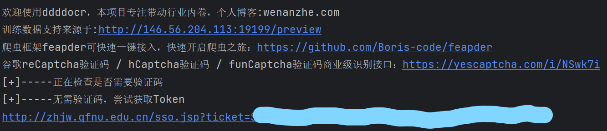

# 曲阜师范大学统一身份验证平台token获取脚本

为了方便各位写爬虫，写了这个曲师大CAS的token获取脚本

### Usage：

---

首先按照requirements.txt安装python环境依赖

```shell
pip install -r requirements.txt
```

向**get_ids_token.py**中的**get_token**函数传递学号与密码以及带有重定向url的CAS的url，函数返回带有ticket的服务url



## 其他版本

[W1ndys的重构版](https://github.com/W1ndys/QFNU-CAS-token)：使用类函数编程重构，使用 requests 的 Session 管理会话，删除了验证码识别功能
